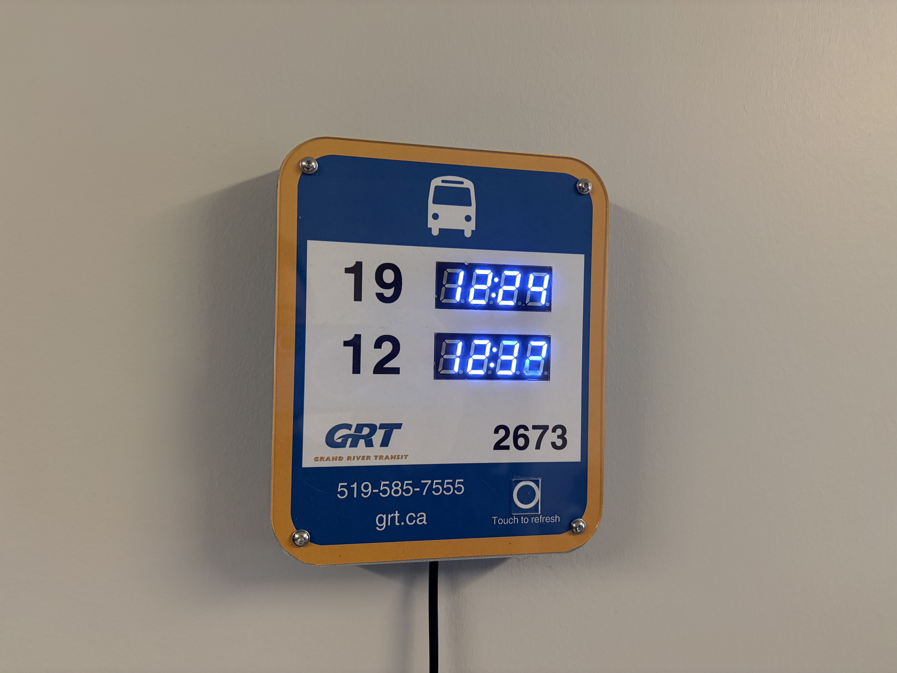

# grt-bustime

Fetch the next two Grand River Transit (GRT) bus arrival times at a stop using a Raspberry Pi and show the arrival time for the two selected bus routes on 7 segment displays.

This project is not affiliated in any way with Grand River Transit. I just like transit.

Interested in doing this yourself? Read the instructions in ```./docs/Instructions.md```.

## Photos



## Why?

There are two busses at the nearest bus stop to my apartment which go to the University of Waterloo. I would like to know when they will arrive at my stop so I can leave early enough to catch them.

This hardware solution is a fun little project and a satifying way to check the times without having to pull out my phone and look at a transit app. It's also a fantastic way for me to try out writing code using an AI Agent (Copilot).

## Design

### Hardware

The hardware centers around a Pi Zero 2W, two 4-digit 7 segment displays with TM1637 drivers, and a TTP223 capacitive touch module. 

The Pi Zero 2W was chosen for its compact size and low power draw. 

Because all that is being displayed is an arrival time, the 7 segment displays are much easier to implement and cheaper than options like an eInk or OLED display. They also more closely match the digital signage present on GRT bus stops.

A capacitive touch module was chosen over a mehcanical button, as it allows for a cleanly integrated button in the display face.

All the componenets were wired together using JST connectors to allow for easy replacement when the display modules inevitably burn out. A perfboard is used to make the wiring very neat - although it could also be done using just jumper wires.

The 3D printed case cleanly integrates all the components in a thin housing and imitates a bus stop sign. All screws thread into heat inserts to ensure longevity. The case retains the Pi's power cable to prevent accidental unplugging.

The printed paper face decal allows for colourful and detailed decals to be displayed, but makes it also very easy to change out if I were to move to a different city and need to update it for a new transit agency. This decal is proctected by an acrylic faceplate.

### Software

The ```bus_arrival_times.py``` script pulls the latest transit arrival time data from the GRT Realtime API. Unfortunately, GRT provides this in the [General Transit Feed Specification (GTFS)](https://gtfs.org/) format, which produces protobuf files which may be too large for most microcontrolers to handle, necessitating the use of a Pi. The realtime data can be searched to produce a list of the exepcted arrival times of all the busses at a certain stop.

The trip numbers of the live trips are compared with the static feed from the GRT API to determine the route number of each inbound bus. This then allows the script to find the arrival times of the next busses of the configured routes and display them using the [Pi TM1637 library](https://github.com/depklyon/raspberrypi-tm1637).

The static data is pulled every 12 hours and then cached. The realtime trip data is pulled every 3 minutes and the displays are refreshed, unless the capacitive touch sensor is pressed which forces fresh realtime data to be pulled.


## Related Projects
Adafruit has a similar NextBus project using the [NextBus](https://rider.umoiq.com/) interface. Their transit clock works with ESP8266, Adafruit MagTag, and Raspberry Pi: [Adafruit NextBus](https://learn.adafruit.com/personalized-esp8266-transit-clock)